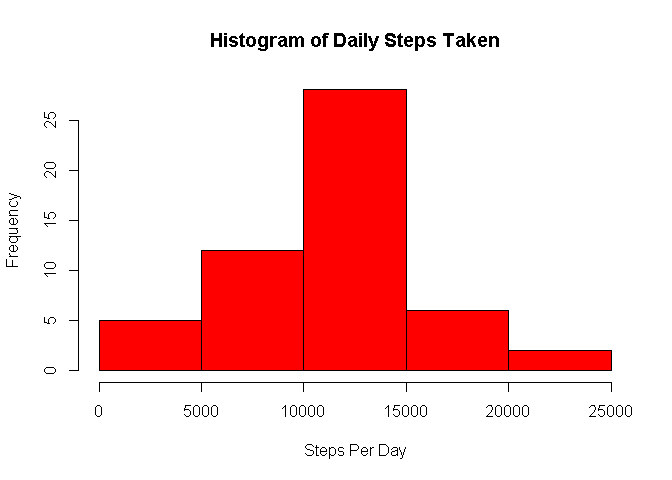
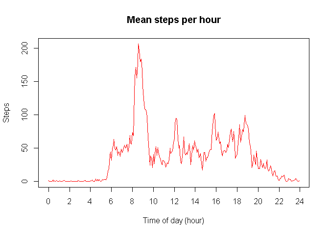
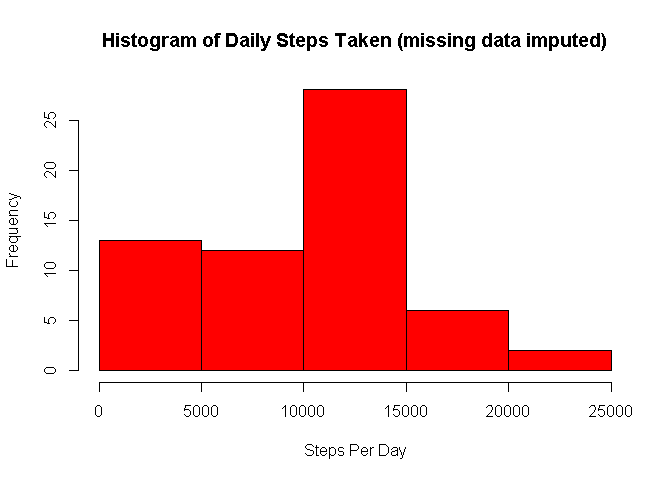
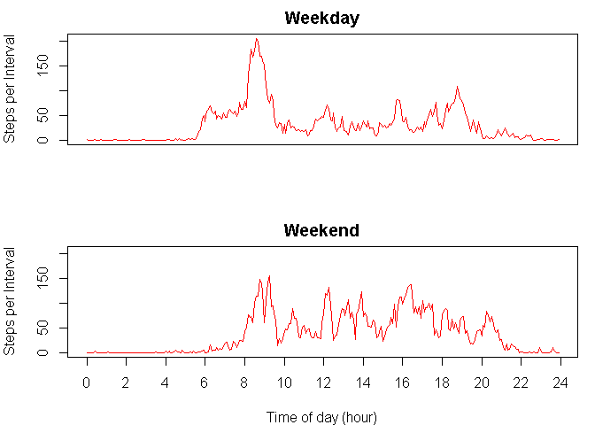

# Reproducible Research: Peer Assessment 1

### Johns Hopkins University / Coursera
### March 2015
  
  
## Overview
  
This document reads in steps-taken data from an activity monitoring device then computes and presents
various descriptive statistics:
  
  1. Daily steps taken (mean and median) along with a distribution of daily steps
  2. Average daily pattern of steps taken by time of day
  3. Differences between weekday and weekend activity
  
For reproducibility, all code required to read in and process the data are presented here along with the output.
  
  
## Loading and preprocessing the data
  
We first read in the data and then add columns to convert the interval data to a figure which
scales linearly with the time.  The interval logged in the file represents time as hhmm, which
introduces gaps between 60-99 if interpreted as a number.
  

```r
tRawData <- read.csv ("activity.csv")
aIntervalAsNumber <- sapply (tRawData$interval, function (x) { x %/% 100 + (x %% 100)/60 } )
tData <- cbind (tRawData, aIntervalAsNumber)
```
  
  
## What is mean total number of steps taken per day?
  
We sum up the total steps taken each day and calculate the mean and median.  A histogram is provided to show the level of dispersion.
  

```r
tStepsPerDay <- aggregate (tData$steps, by = list(tData$date), FUN=sum)
names(tStepsPerDay) <- c("Date", "Steps")

cDailyStepsMean <- mean (tStepsPerDay$Steps, na.rm = TRUE)
cDailyStepsMedian <- median (tStepsPerDay$Steps, na.rm = TRUE)
cDailyStepsMin <- min (tStepsPerDay$Steps, na.rm = TRUE)
cDailyStepsMax <- max (tStepsPerDay$Steps, na.rm = TRUE)
  
hist(tStepsPerDay$Steps, col = "red", main = "Histogram of Daily Steps Taken", xlab = "Steps Per Day")
```

 
  
In our dataset, between 41 and 21194 steps were taken daily, with a **mean of 10766 steps** and **median of 10765 steps**.
  
  
## What is the average daily activity pattern?
  
  

```r
tDailyPattern <- aggregate (tData$steps, by = list (tData$aIntervalAsNumber), FUN=mean, na.rm = TRUE)
names(tDailyPattern) = c("Interval", "Steps")
cIntervalStepsMax <- max (tDailyPattern$Steps)
cIntervalMax <- tDailyPattern$Interval [tDailyPattern$Steps == cIntervalStepsMax]

plot (tDailyPattern, type = "l", col = "red", main = "Mean steps per hour", xlab = "Time of day (hour)", xaxt = 'n')
axis (1, at = seq(from = 0, to = 24, by = 2))
```

 
  
As might be expected, the step activity is concentrated during normal waking hours.  This individual appears to do most walking in the morning, with the **peak of 206 mean steps taken at 8:35**.
  
  
## Imputing missing values
  

```r
cMissingData <- nrow (tData[is.na (tData$steps), ])
cMissingDataRatio <- cMissingData / nrow (tData)
```
  
  
The above statistics have been presented without any treatment for missing values.  We found there are **2304 intervals total with missing data**, or 13.11% of the dataset.  Here **we fill in missing values with the median (across all days with data) for the time of day**.
  
  

```r
tIntervalMedian <- aggregate (tData$steps, by = list (tData$interval), FUN = median, na.rm = TRUE)
names(tIntervalMedian) = c("Interval", "Steps")
tImputedData <- tData
for (i in 1:nrow (tImputedData)) {
  if (is.na (tImputedData$steps[i])) {
    tImputedData$steps[i] <- tIntervalMedian$Steps[tIntervalMedian$Interval == tImputedData$interval[i]]
  }
}

tImputedStepsPerDay <- aggregate (tImputedData$steps, by = list(tImputedData$date), FUN=sum)
names(tImputedStepsPerDay) <- c("Date", "Steps")

cImputedDailyStepsMean <- mean (tImputedStepsPerDay$Steps, na.rm = TRUE)
cImputedDailyStepsMedian <- median (tImputedStepsPerDay$Steps, na.rm = TRUE)
cImputedDailyStepsMin <- min (tImputedStepsPerDay$Steps, na.rm = TRUE)
cImputedDailyStepsMax <- max (tImputedStepsPerDay$Steps, na.rm = TRUE)
  
hist(tImputedStepsPerDay$Steps, col = "red", main = "Histogram of Daily Steps Taken (missing data imputed)", xlab = "Steps Per Day")
```

 

Comparing the above histogram with the original, we see that a number of lower activity days (under 500 steps) have been added.  This suggests that when data was missing, it was for an entire day, not just a few intervals within a day.  With the imputed data, the **mean daily steps taken has dropped to 9504 (from 10766), and median has dropped to 10395 (from 10765).**  This suggests he median for any interval is typically below the mean, suggesting a pattern of some high activity days sprinkled amidst typical lower activity days.

(a quick scan of the dataset seems to confirm this)
  
  
## Are there differences in activity patterns between weekdays and weekends?

A comparison of weekday and weekend activity is presented below:


```r
tImputedData <- cbind (tImputedData, weekday = weekdays(as.Date(tImputedData$date)), stringsAsFactors = FALSE)
for (i in 1:nrow (tImputedData)) {
  if (tImputedData$weekday[i] %in% c("Saturday", "Sunday")) {
    tImputedData$weekday[i] <- "Weekend"
  } else {
    tImputedData$weekday[i] <- "Weekday"
  }
}

tWeekdayPattern <- aggregate (tImputedData$steps, by = list (tImputedData$weekday, tImputedData$aIntervalAsNumber), FUN=mean, na.rm = TRUE)
names(tWeekdayPattern) = c("Weekday", "Interval", "Steps")

par (mfrow = c(2, 1), mar = c(4, 4, 2, 1))
plot (tWeekdayPattern[tWeekdayPattern$Weekday == "Weekday", 2:3], type = "l", col = "red", main = "Weekday", ylab = "Steps per Interval", xaxt = 'n', xlab = "", ylim = c (0, max (tWeekdayPattern$Steps)))
plot (tWeekdayPattern[tWeekdayPattern$Weekday == "Weekend", 2:3], type = "l", col = "red", main = "Weekend", ylab = "Steps per Interval", xlab = "Time of day (hour)", xaxt = 'n', ylim = c (0, max (tWeekdayPattern$Steps)))
axis (1, at = seq(from = 0, to = 24, by = 2))
```

 

We see that **this individual appears to rise a little bit later on the weekend, but is more active throughout the day**.
